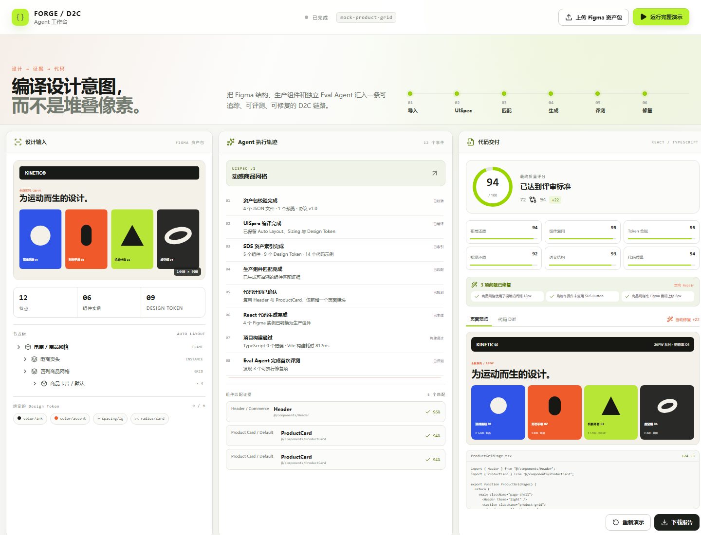

# D2C Agent Workbench

一个面向面试演示的、可追踪且可评测的 Design-to-Code 工作台。它把结构化 Figma 资产编译为 UISpec，基于团队设计系统匹配组件与 Design Token，再通过 Build / Eval 双 Agent 工作流完成代码生成、问题归因和自动修复。

  



## 当前 Demo 能做什么

- 读取并校验离线 `figma-bundle.zip`，包括 Node Tree、Auto Layout、变量、组件实例和 SVG 预览。
- 将 Figma 结构递归编译为稳定、可验证的 UISpec。
- 在固定 SDS Registry 中检索 `Header`、`ProductCard` 等组件，展示置信度与匹配证据。
- 默认由浏览器端 Mock Adapter 播放 12 步类型化 Agent 轨迹，不依赖后端、网络或模型服务。
- 上传真实 Figma Bundle 时，通过 Fastify 与 SSE 展示同一套工作流；上传失败可显式降级到演示数据。
- 独立计算 Geometry、组件复用、Token 合规、视觉、语义和代码质量。
- 演示首轮 72 分、Repair Agent 修复、复评 94 分的闭环。
- 下载包含 Run、Trace、Mapping 和 Evaluation 的结构化报告。
- 使用全 Mock 数据展示完整输入、组件映射、代码、评测与修复，避免面试现场受模型、网络和 Figma 权限影响。

> 当前竖切 Demo 的默认 Agent 输出是浏览器端确定性 Mock，不会伪装成实时大模型调用。真实上传与 Mock 降级会在界面中明确区分。核心接口已经把 Mock、真实 Codex 和未来 Figma MCP 隔离开；后续只需替换 Adapter，不改 UISpec、评测和工作台协议。

## 立即运行

环境要求：Node.js 22+、pnpm 11+。

```bash
pnpm install
pnpm --filter @d2c/web dev
```

访问 `http://127.0.0.1:5173`，点击 **运行完整演示**。这条默认路径完全在浏览器内执行，只启动前端即可完成 72→94 的完整流程。

需要验证真实 Bundle 上传时，运行 `pnpm dev` 同时启动前端与 `http://127.0.0.1:8787` 的 Fastify 服务。

如需演示上传，直接选择仓库根目录的 `product-grid.zip`。修改示例资产后，可在 PowerShell 中重新生成：

```powershell
Compress-Archive -Path .\examples\figma-bundles\product-grid\* -DestinationPath .\product-grid.zip -Force
```

然后点击 **上传 Figma 资产包** 选择 `product-grid.zip`。如果服务不可用，界面会显示 **使用演示数据继续**，由用户主动切换到 Mock 流程。

## 验证

```bash
pnpm typecheck
pnpm test
pnpm build
pnpm exec playwright install chromium
pnpm e2e
```

## 架构

```text
浏览器 Mock Adapter ──────────────────────────────┐
                                                  ▼
Figma Bundle → Safe Importer → UISpec → SDS Matcher → React Web
                                  │                  ▲
                                  ▼                  │
                       Build Agent → Eval Agent → SSE Trace
                            ▲            │
                            └── Repair ───┘
```

| 模块 | 职责 |
|---|---|
| `packages/contracts` | Bundle、UISpec、Trace、Evaluation 的 Zod 协议 |
| `packages/figma-importer` | ZIP 安全检查、资产解析和输入验证 |
| `packages/ui-compiler` | Auto Layout、Sizing、Token 到 UISpec |
| `packages/component-matcher` | SDS 候选召回、排序、证据和置信度 |
| `packages/orchestrator` | Build / Eval / Repair 状态机与 Replay |
| `packages/evaluator` | 六维加权评测、Violation 和修复对比 |
| `apps/server` | Run 管理、上传 API 和 SSE 事件流 |
| `apps/web` | 三栏 Agent 工作台和报告交付 |

完整产品设计、边界和后续真实 Agent 路径见 [D2C Agent Workbench 设计](docs/superpowers/specs/2026-08-24-d2c-agent-workbench-design.md)。面试现场讲解见 [10 分钟 Demo 脚本](docs/demo-script.md)。

## 安全边界

- 拒绝 ZIP Path Traversal、绝对路径与超限压缩包。
- 使用 Zod 验证全部跨模块数据，不直接信任 Figma 或 Agent 输出。
- Demo 只读取内置 SDS 资产，不执行上传内容中的代码。
- 真实代码仓库接入将使用独立 Workspace、命令允许列表和 Artifact 边界。

## 设计参考

方案参考了 [Figma Plugin Samples](https://github.com/figma/plugin-samples)、[Figma SDS](https://github.com/figma/sds)、[Figma Code Connect](https://github.com/figma/code-connect)、[Raw JSON Exporter](https://github.com/kasper573/figma-plugin-raw-json-exporter) 与 [DesignFit](https://github.com/as9978/designfit) 的公开思路。当前实现为独立编写，未复制第三方源码。
